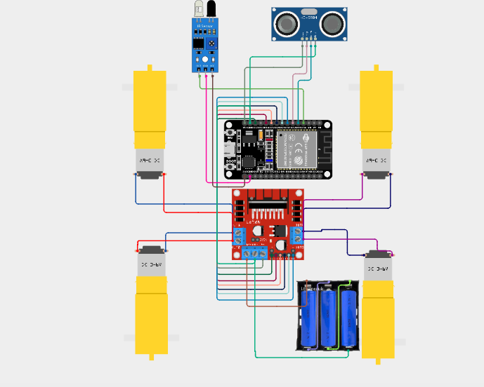
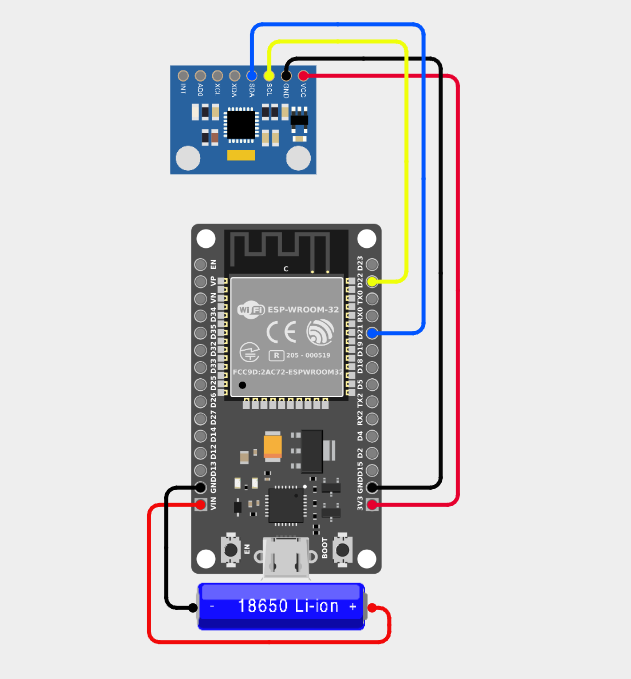
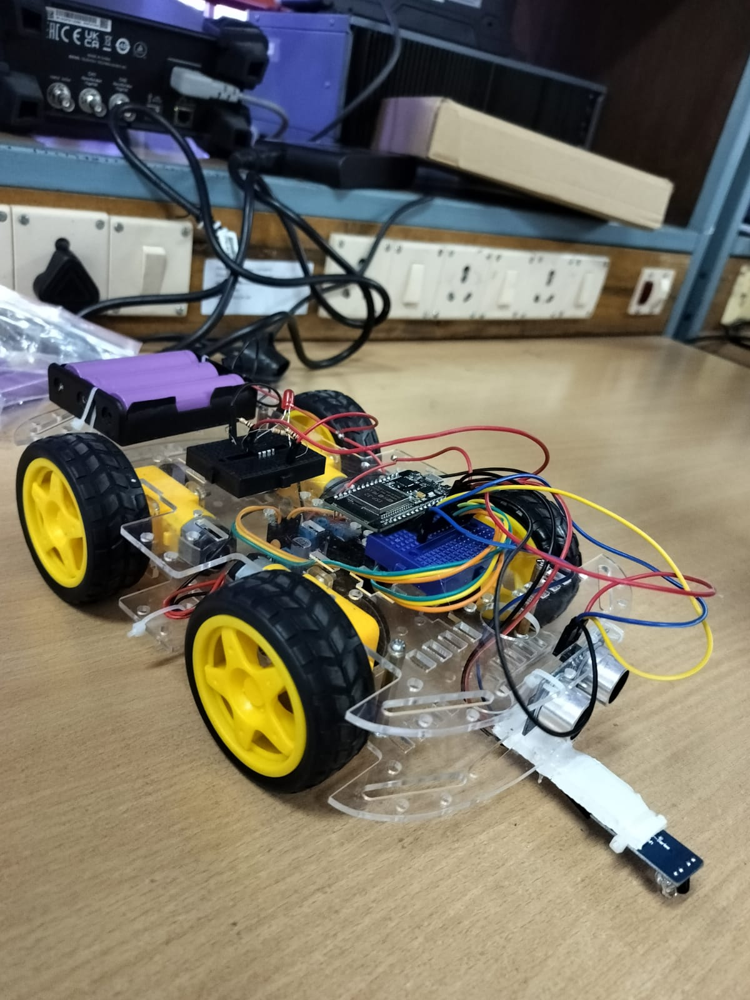

# Semi-Autonomous Rover with Human-Kinetic Interface

A semi-autonomous rover controlled through human hand movements using an MPU6050 IMU and ESP32. The rover combines wireless motion control with ultrasonic and IR-based safety mechanisms for obstacle and cliff detection.

## Project Overview

The system consists of two ESP32-based units:

- A **smart glove transmitter** that detects hand orientation using the MPU6050 IMU.
- A **rover receiver** that receives motion commands through ESP-NOW and controls the motors.

The rover also includes an autonomous safety system that can override forward movement when an obstacle or cliff is detected.

## Key Features

- Hand-motion based rover control
- MPU6050-based pitch and roll detection
- ESP-NOW wireless communication
- PWM-based motor speed control
- Ultrasonic obstacle detection
- IR-based cliff/drop detection
- Safety-veto mechanism
- Four-wheel drive rover

## System Architecture

**Smart Glove → ESP-NOW → Rover ESP32 → Motor Driver → DC Motors**

At the same time:

**Ultrasonic Sensor + IR Sensor → Safety Logic → Motor Control Override**

## Hardware Components

- ESP32 × 2
- MPU6050 IMU
- L298N Motor Driver
- DC Geared Motors × 4
- Ultrasonic Sensor
- IR Sensor
- 3S Lithium-Ion Battery Pack
- Rover Chassis and Wheels
- Jumper Wires

## Software

- Arduino IDE
- ESP32 Arduino Core
- ESP-NOW
- C/C++

## Circuit Diagrams

### Rover Circuit Diagram

### Transmitter Circuit Diagram

## Project Photograph

## Project Demonstration

▶️ **[Watch the Project Demonstration](./project_demo.mp4)**

## Source Code

### Transmitter

[glove_transmitter.ino](./glove_transmitter.ino)

### Rover Receiver

[rover_receiver.ino](./rover_receiver.ino)

## Project Report

[📄 View Project Report](./Project_report.pdf)

## Safety Mechanism

The rover continuously checks its surroundings using the ultrasonic and IR sensors.

If an obstacle is detected within the configured safety distance or a drop/cliff is detected, the rover stops forward motion automatically.

This safety mechanism has priority over the user's forward command.

## Author

**Masoom Ali**

B.Tech – Electrical and Electronics Engineering  
IIT Guwahati
